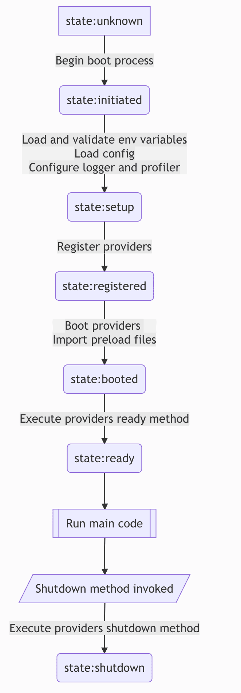

### application


#### AdonisJS的应用模块负责在不同的已知环境中引导应用。

#### 当您从server.ts文件启动HTTP服务器或运行节点ace serve命令时，应用程序将为web环境启动。

#### 而运行节点ace repl命令会在repl环境中引导应用程序。所有其他命令在控制台环境中引导应用程序。

#### 应用程序的环境在决定执行哪些操作时起着至关重要的作用。例如，网络环境不注册或引导Ace提供程序。

#### 您可以使用环境属性访问应用程序的当前环境。以下是已知应用程序环境的列表。

* web环境是指为HTTP服务器启动的进程。
* 控制台环境指的是除REPL命令之外的Ace命令。
* repl环境是指使用节点ace REPL命令启动的进程。
* 测试环境是为将来AdonisJS内置测试运行时而保留的。

```js
  import Application from '@ioc:Adonis/Core/Application'
  console.log(Application.environment)
```

### 引导生命周期

#### 以下是应用程序的引导生命周期。



#### 一旦应用程序状态设置为“已启动”或“就绪”，您就可以访问IoC容器绑定。试图在引导状态之前访问容器绑定会导致异常。

#### 例如，如果您有一个想要解析容器绑定的服务提供者，您应该在boot或ready方法中编写import语句。

#### × 顶级导入将不起作用

```js
  import { ApplicationContract } from '@ioc:Adonis/Core/Application'
  import Route from '@ioc:Adonis/Core/Route'

  export default class AppProvider {
    constructor(protected app: ApplicationContract) {}

    public async boot() {
      Route.get('/', async () => {})
    }
  }
```

#### √ 在引导方法内移动导入

```js
  import { ApplicationContract } from '@ioc:Adonis/Core/Application'

  export default class AppProvider {
    constructor(protected app: ApplicationContract) {}

    public async boot() {
      const { default: Route } = await import('@ioc:Adonis/Core/Route')
      Route.get('/', async () => {})
    }
  }
```

### 版本

#### 您可以使用版本和adonisVersion属性访问应用程序和框架版本。

#### version属性引用应用程序的package.json文件中的版本。adonisVersion属性引用@adonisjs/core包的已安装版本。

```js
  import Application from '@ioc:Adonis/Core/Application'

  console.log(Application.version!.toString())
  console.log(Application.adonisVersion!.toString())
```

#### 两个版本属性都表示为一个具有主要、次要和修补程序子属性的对象。

```js
  console.log(Application.version!.major)
  console.log(Application.version!.minor)
  console.log(Application.version!.patch)
```

### node 环境

#### 您可以使用节点环境属性访问节点环境。该值是对NODE_ENV环境变量的引用。然而，该值被进一步规范化以保持一致。

```js
  import Application from '@ioc:Adonis/Core/Application'

  console.log(Application.nodeEnvironment)
```

| NODE_ENV | Normalized to |
| -------- | ------------  |
| dev      |	development  |
|develop	|development |
|stage	| staging |
|prod	| production |
|test	| testing |

#### 此外，您可以使用以下属性作为了解当前环境的简写。

### 生成中 inProduction
```js
  Application.inProduction

  // Same as
  Application.nodeEnvironment === 'production'
```

### 开发中 inDev
```js
  Application.inDev

  // Same as
  Application.nodeEnvironment === 'development'
```

### 创建项目目录的路径

#### 您可以使用应用程序模块来创建已知项目目录的绝对路径。

### configPath

#### 在配置目录中创建一个文件的绝对路径。

```js
  Application.configPath('shield.ts')
```

### publicPath

#### 创建公共目录中文件的绝对路径。

```js
  Application.publicPath('style.css')
```

### databasePath

#### 创建数据库目录中文件的绝对路径。
```js
  Application.databasePath('seeders/Database.ts')
```

### migrationsPath

#### 创建迁移目录中文件的绝对路径。

```js
  Application.migrationsPath('users.ts')
```

### seedsPath

#### 创建种子目录中文件的绝对路径.

```js
  Application.seedsPath('Database.ts')
```

### resourcesPath

#### 创建资源目录中文件的绝对路径。

```js
  Application.resourcesPath('scripts/app.js')
```

### viewsPath
#### 创建视图目录中文件的绝对路径.

```js
Application.viewsPath('welcome.edge')
```

### startPath
#### 创建起始目录中文件的绝对路径。

```js
Application.startPath('routes.ts')
```

### tmpPath
#### 在应用程序tmp目录中创建一个文件的绝对路径。

```js
Application.tmpPath('uploads/avatar.png')
```

### makePath
#### 从应用程序的根目录创建一个绝对路径。

```js
Application.makePath('app/Middleware/Auth.ts')
```

### 其他属性
#### 下面是应用程序模块的属性列表。


### appName
#### 应用程序的名称。它引用应用程序的package.json文件中的name属性。

```js
Application.appName
```

### appRoot
#### 应用程序根目录的绝对路径。
```js
Application.appRoot
```

### rcFile
#### 对已解析的AdonisRc文件的引用。
```js
Application.rcFile.providers
Application.rcFile.raw
```

### container
#### 对IoC容器实例的引用。
```js
Application.container
```

### helpers
#### 对助手模块的引用。
```js
Application.helpers.string.snakeCase('helloWorld')
```

#### 您也可以直接访问助手模块。
```js
import { string } from '@ioc:Adonis/Core/Helpers'

string.snakeCase('helloWorld')
```

### logger
#### 对应用程序记录器的引用。
```js
Application.logger.info('hello world')
```

#### 您也可以直接访问记录器模块。
```js
import Logger from '@ioc:Adonis/Core/Logger'
Logger.info('hello world')
```

### config
#### 对配置模块的引用。
```js
Application.config.get('app.secret')
```

#### 您也可以直接访问配置模块。
```js
import Config from '@ioc:Adonis/Core/Config'

Config.get('app.secret')
```

### env
#### 对环境模块的引用。
```js
Application.env.get('APP_KEY')
```

#### 您也可以直接访问env模块。
```js
import Env from '@ioc:Adonis/Core/Env'
Env.get('APP_KEY')
```

### isReady
#### 查找应用程序是否处于就绪状态。当isReady为false时，它在内部用于停止接受新的HTTP请求。
```js
Application.isReady
```

### isShuttingDown
#### 查找应用程序是否处于关闭过程中。
```js
Application.isShuttingDown
```