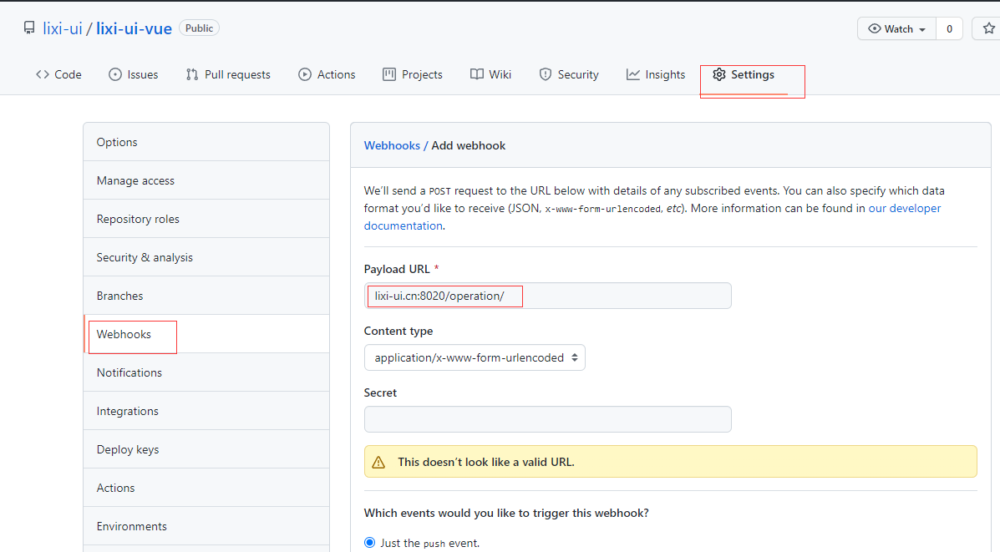

### 介绍

### deploy 部署项目

### 将服务部署到 云服务器上

```sh
  ### 登录云服务器 输入 ip 与 密码
  ssh ubuntu@*.*.*.* 
```

### clone与启动项目

```sh
  ## git 拉去项目
  git clone git@github.com:lixi-ui/lixi-web-vue.git
  ## 进入项目
  cd lixi-web-vue
  ## 安装依赖
  npm install
  ## 启动服务
  npm run server
```

### git 上设置Webhooks调用钩子 


### 使用 git push 提交到远程仓库时,会触发请求 lixi-ui.cn:8020/operation/

### 启动node服务器。

```sh
  ## 启动服务器
  node run server
```

### 文件 server\routes\operation.js 会接受请求并执行脚本

```js
var express = require('express');
var router = express.Router();
var exec = require('child_process').exec;

var shStr = 'sh ./script/deploy.sh'; 

router.get('/', function(req, res, next) { // get 请求
  exec(shStr ,function(error,stdout,stderr){
    console.log(error,stdout,stderr)
  })
  res.json(req.query);
});

router.post('/', function(req, res, next) { // post 请求
  exec(shStr ,function(error,stdout,stderr){ // 执行的是 sh 脚本。 代码只能在 linux 下执行。
    console.log(error,stdout,stderr)
  })
  res.json(req.body);
});

module.exports = router;

```

### 服务端执行 sh 脚本。并更新代码到 public 下

```sh
#!/bin/sh

## 拉取git最新代码。与git代码同步
git pull

## 打包代码 (由于本人服务器内存过小,在打包时,不能正常执行,所以自动化构建不能形成)
npm run build

## 删除旧代码
rm -r ./server/public/*

## 移动最新打包的代码 到公共文件上
cp -r ./dist/* ./server/public/

# 最终页面内容更新

```

> 只要一提交git代码, git 就会调用钩子, 去请求服务器。 服务器接受到请求之后，拉取最新git代码. 进行打包. 替换最新的代码。最终更新项目。

