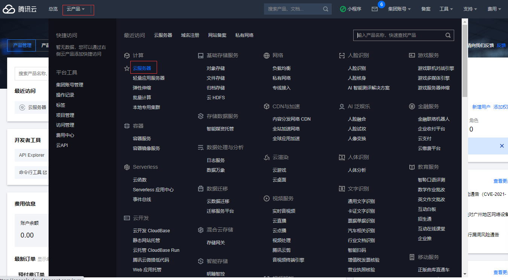
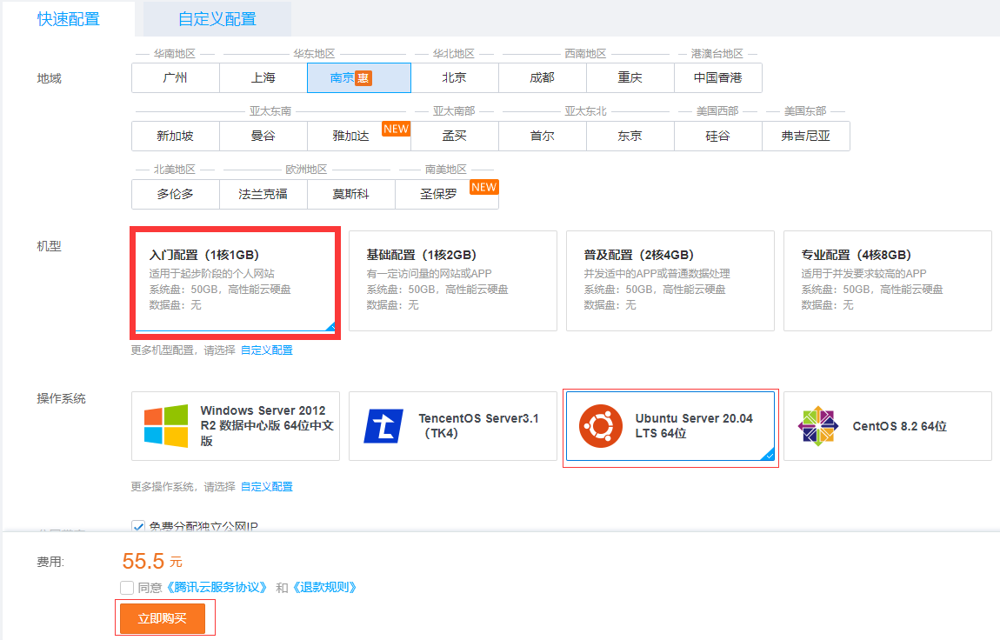
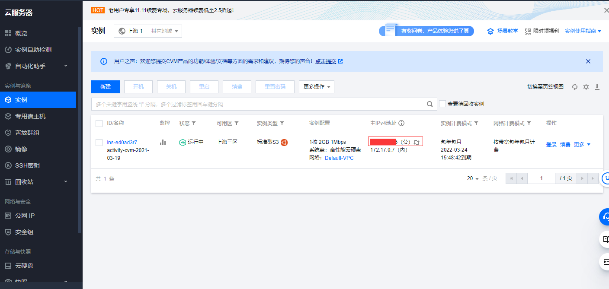
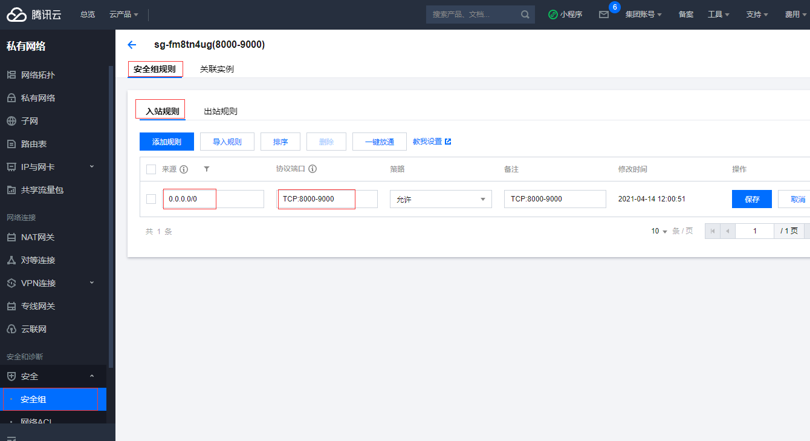
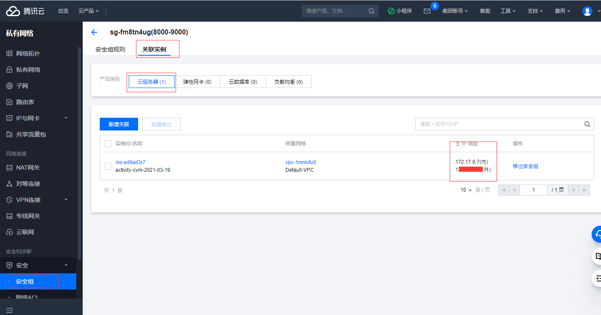

## 云服务器

### 这里以腾讯云为例

### 微信登录  腾讯云 (https://cloud.tencent.com/)

### 登录了之后进入控制台


<!--  -->

### 选择 云服务


<!--  -->

### 新建，选择 入门配置， ubuntu 系统。 购买就行


<!--  -->


### 会得到公网ip 购买云服务器成功



<!--  -->

### 输入你的公网 ip 及 密码登录云服务器
```sh
  ssh ubuntu@*.*.*.*
```

### 添加安全组 开通tcp端口 8000-9000.


<!--  -->

### 关联实例，服务器的端口就能访问了



### 关联完实例，端口就开放出去了，云服务上的 端口 8000-9000 可以使用 tcp 访问了
